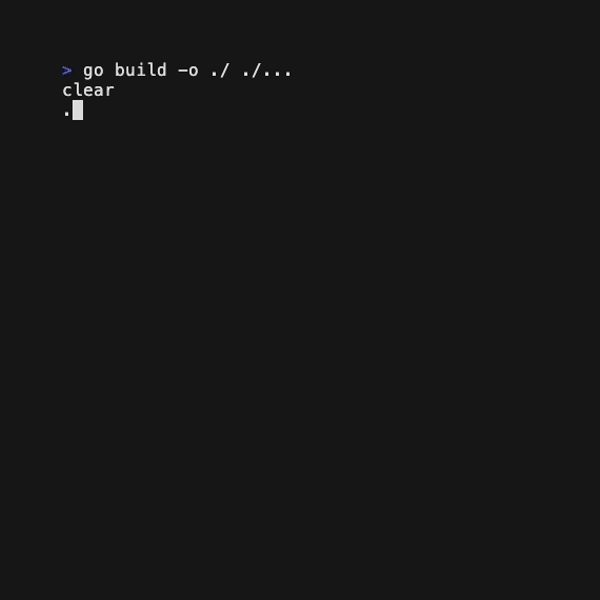

# Tetrigo

*teh·tree·go*

A Golang implementation of Tetris, attempting to follow the official [2009 Tetris Design Guideline](https://github.com/Broderick-Westrope/tetrigo/tree/main/docs/2009-Tetris-Design-Guideline.pdf).

This project is a work in progress. I plan to separate the included TUI (Terminal User Interface) from the game logic. This will allow it to be easily reused to create game variants and other user interfaces.

Please feel free to open issues with suggestions, bugs, etc.

## TODO

- High Score system
- More game modes
    - Sprint
    - Ultra 
- Multiplayer
- Ghost piece
- ~~Configuration file~~
- Check for lockdown 0.5s after landing on a surface
    - Also on soft drop, but not on hard drop
    - This resets after each movement & rotation, for a total of 15 movements/rotations.
    - See "Extended Placement Lock Down"
- Game over conditions
    - Game over screen
- ~~Drop one row immediately if nothing is blocking~~
- Pause ('P' key?)
- ~~Fix Tetrimino rotation axis~~
- Implement SRS (Super Rotation System)
- Score points from soft & hard drops
- T-Spins