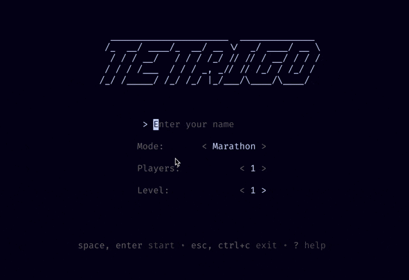

# Tetrigo

*teh·tree·go*



A Golang implementation of Tetris, following the official [2009 Tetris Design Guideline](./docs/2009-Tetris-Design-Guideline.pdf).

This project consists of three main components, depending on what your goals are:
- ***"I just want to play Tetris"***
  - The TUI (Text User Interface) in `cmd/tetrigo/` is for you. See the [installation](#installation) section.
- ***"I want to create my own Tetris game/UI"***
  - The packages in `pkg/tetris/modes/` are for you. You can reuse these game modes with your own UI.
- ***"I want to create my own Tetris game mode"***
  - The packages in `pkg/tetris/` are for you. You can create your own game mode with a custom set of rules and requirements.

You can find more information on these sections in the [development](#development) section. If you have a suggestion, bug, or feature request, please open a GitHub issue.

## Contents

- [Installation](#installation)
- [Usage](#usage)
- [Configuration](#configuration)
- [Data](#data)
- [Development](#development)

## Installation

Tetrigo can be installed by downloading the binary or by building from source. See the instructions below for your preferred method.

### Binary

You can download the binary corresponding to your operating system from the [releases page on GitHub](https://github.com/stuttgart-things/sthings-tetris/releases).

Once downloaded you can run the binary from the command line:

```bash
# Linux or macOS
./tetrigo

# Windows
tetrigo.exe
```

Optionally, you can move the binary to a directory in your `$PATH` to run it from anywhere ([example](https://gist.github.com/nex3/c395b2f8fd4b02068be37c961301caa7)).

### Build From Source

Ensure that you have a supported version of Go properly installed and setup. You can find the minimum required version of Go in the [go.mod](./go.mod) file.

You can then install the latest release globally by running:

```bash
go install github.com/stuttgart-things/sthings-tetris/cmd/tetrigo@v0.1.6
```

## Usage

For general information on how to play Tetris see [this beginners guide](https://tetris.com/article/33/tetris-tips-for-beginners).

### Controls

The default game controls are as follows:

- **Move Left**: `A`
- **Move Right**: `D`
- **Toggle Soft Drop On/Off**: `S`
- **Hard Drop**: `W`
- **Rotate Clockwise**: `E`
- **Rotate Counter-Clockwise**: `Q`
- **Hold Tetrimino / Submit menu option**: `Space` or `Enter`
- **Pause Game / Exit**: `Escape`
- **Force Quit game**: `Ctrl+C`
- **Show Controls Help**: `?`

The game controls can be changed in the configuration file.

The menu, leaderboard, etc can be navigated using the arrow keys (moving), escape (exit), and enter (submit). These controls are not configurable.

## Configuration

### CLI

Starting Tetrigo with no subcommand or flags will start the game in the menu where you can manually configure simple settings like the player name and game mode:

```bash
./tetrigo
```

You're also able to start the game directly in a game mode (eg. Marathon), skipping the menu:

```bash
# Start the game in Marathon mode with a level of 5 and the player name "Brodie"
./tetrigo play marathon --level=5 --name=Brodie
```

To see more options for starting the game you can run:

```bash
./tetrigo --help
```

### TOML

More complex configuration can be done using a TOML file. If no config file is found sensible defaults will be used.

By default, Tetrigo will look for the file `./tetrigo/config.toml` within the devices XDG config (or equivalent) directory. The [adrg/xdg](https://github.com/adrg/xdg) defines values `XDG_CONFIG_HOME` for various operating systems (eg. on macOS it is `~/Library/Application Support` directory exists it will be stored there, otherwise in `~/Library/Preferences`). You can specify a different file using the `--config` flag.

```bash
./tetrigo --config=/path/to/config.toml
```

An example configuration file is provided in [`example.config.toml`](./example.config.toml).

## Data

The game data is stored in a SQLite database. By default, the database is stored in `./tetrigo/tetrigo.db` within the devices XDG data (or equivalent) directory. The [adrg/xdg](https://github.com/adrg/xdg) defines `XDG_DATA_HOME` for various operating systems (eg. on macOS if the `~/Library/Application Support` directory exists it will be stored there, otherwise in `/Library/Application Support`). You can specify a different file path using the `--db` flag.

```bash
./tetrigo --db=/path/to/data.db
```

## Development

This project consists of three main components:
1. `cmd/tetrigo/`: A TUI (Text User Interface) allowing you to play it out of the box. It also serves as a demonstration on how to use the packages and how to create a TUI using [Bubble Tea](https://github.com/charmbracelet/bubbletea).
2. `pkg/tetris/modes/`: The functionality for different Tetris game modes. This can be used to easily create a Tetris game with your own UI but without needing to know the ruleset.
3. `pkg/tetris/`: The core Tetris logic, including things like Tetrminimos, the Matrix, and scoring. This can be used to create game modes with your own ruleset and requirements.

[Task](https://taskfile.dev/) is the build tool used in this project. The Task config lives in [Taskfile.yaml](./Taskfile.yaml). Once the Task CLI is installed, you can see all available tasks by running:
```bash
task -l
```

You can run the TUI using the `run` task:
```bash
task run
```

### Building

You can build the project using the `build` task:
```bash
task build
```

This will create a binary in the `bin/` directory which can be run using the instructions in the [Installation](#installation) section.

### Testing

Tests can be run using the `test` task:
```bash
task test
```

You can also use the `cover` task to generate and open a coverage report:
```bash
task cover
```

The ordered priorities for testing are:
1. `pkg/tetris/`
2. `pkg/tetris/modes/`
3. `cmd/tetrigo/`

### TODO

- Add more tests
  - Add tests for scoring endOnMaxLevel.
  - Revisit scoring tests.
- Add the remaining Lock Down options.
- Check for Lock Down 0.5s after landing on a surface
  - Also on Soft Drop, but not on Hard Drop.
  - This resets after each movement & rotation, for a total of 15 movements/rotations.
  - See "Extended Placement Lock Down" in the design guidelines.
- Score points from T-Spins
- SSH Multiplayer (akin to [Gambit](https://github.com/maaslalani/gambit))
